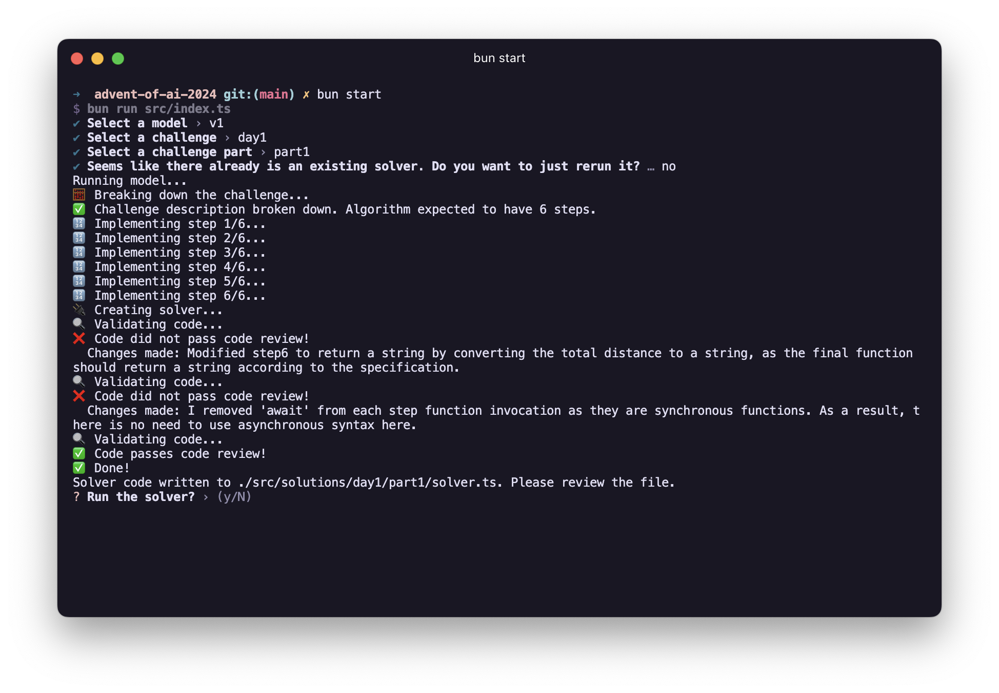
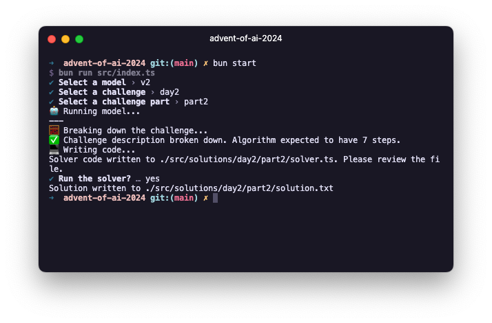

# advent-of-ai-2024

An attempt at the Advent of Code 2024 challenge, without directly writing any code.

## About

This is a project to try and use an LLM to generate the code that should solve every day's Advent of Code challenge.

I am going to do that by writing "models" that should be able to solve a given challenge, and tweaking them until they do.

## Goals
Main goal: **solve all 25 challenges by only writing models that can solve them for me**
Secondary goal: **do so with as few models as possible**

## Project structure

It has three directories:
- `challenges`: where every day's challenge is defined.
- `models`: my attempts at creating models to solve the challenges.
- `solutions`: where the LLM generated code and solutions are saved.

## Rules
1. **I cannot write any code directly under the `solutions` directory**
2. Instead, I will write models under the `models` directory.
3. A model must be fully autonomous. It must be able to solve a challenge without prompting me for any input.
4. For any given challenge, I cannot provide any input data aside from the interface defined in the `challenge.ts` file.
5. While in the process of solving a challenge, I can refactor the current model. But, once a model manages to solve a challenge, it becomes immutable and I can no longer change it. At this point, if my latest model fails at solving the next challenge, I will have to create a new one.
6. My models cannot be specifically trained to solve any individual challenge. That is, I cannot give them any directives based on the challenge itself ("note that there are 11 elves sorting the presents at the same time"), but instead I can only give them general instructions ("while writing your solution, take parallelism into account").

## Running the project
The project uses Bun. If you have Bun installed, you can simply run the following to get started:

```sh
bun install
bun start
```

If you do not wish to use Bun, just make sure that your alternative runtime supports typescript, `.env` files, and top-level `await`.

## Models

### v1



I originally planned to just feed the instructions to ChatGPT and have it write the code. I soon realized that it wouldn't work because the code did not follow the instructions, had some very weird inconsistencies, and in some places even contradicted itself.

So, I decided to give the model a bit more direction by instructing it to work a little bit like a human would:
1. First, it should describe the problem, including how to parse the input, and steps to solve it.
2. Then, it should implement each step individually as a separate function. Each function receives the input I tell it to expect (either the raw input, or the output of the previous step), and returns the output it thinks should match the expected result of that step (pure string for the last step).
3. Then, I instructed it to create the exported "solver" function, which should use all the steps it created in the previous steps, and return the expected result as string.
4. Finally, I told it to perform code review on the generated code. If it failed the review, it explains why and provides a revised version of the code, which is then also reviewed.
5. Finally, after however many iterations it took to get the code right, once the code finally passes the review, that's what I return back as the solution.

This model managed to solve the following challenges:
- [Day 1, Part 1](./src/solutions/day1/part1)
- [Day 1, Part 2](./src/solutions/day1/part2)



The previous model was having a hard time following my exact instructions. And why should it? The challenges provided in the first days are not that complex. Any modern LLM should be able to solve them with minimal direction.

So, I decided to simplify the instructions. Instead of having it describe the algorithm and then implement each step individually, I just asked it to write the code that solves all the steps it described.

I also asked it to infer example inputs and outputs from the challenge description, meaning to use it to test the code; but so far it managed to solve all the challenges without it, so that's probably going to be included in v3.

This model managed to solve the following challenges:
- [Day 2, Part 1](./src/solutions/day2/part1)
- [Day 2, Part 2](./src/solutions/day2/part2)
